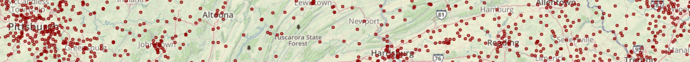
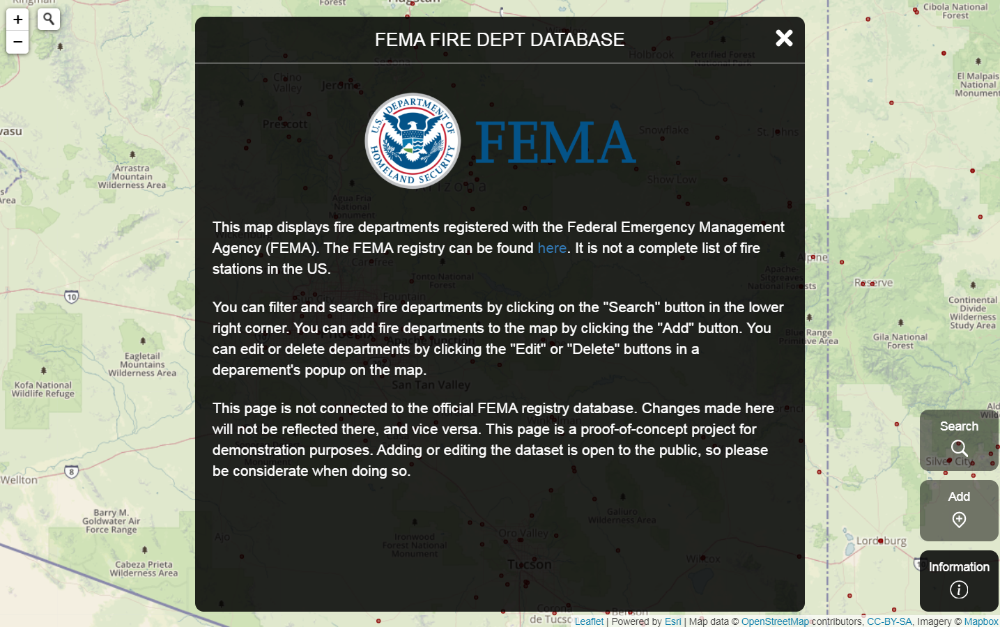
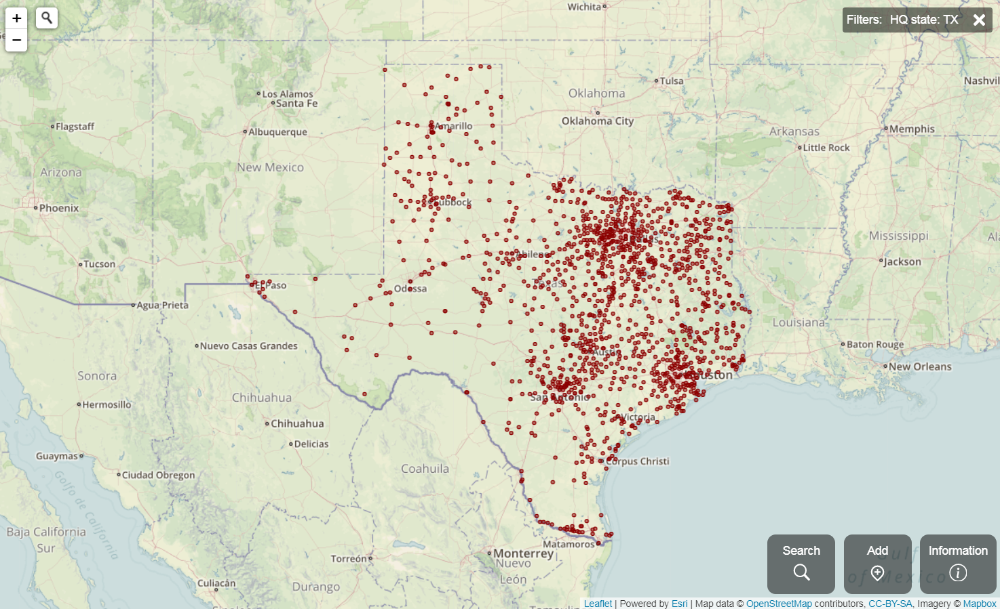
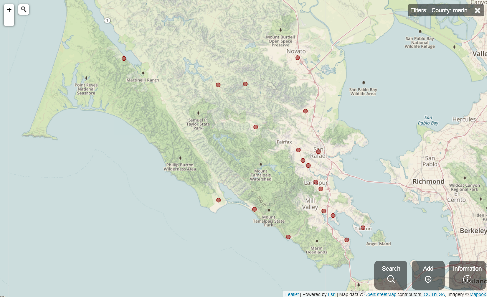
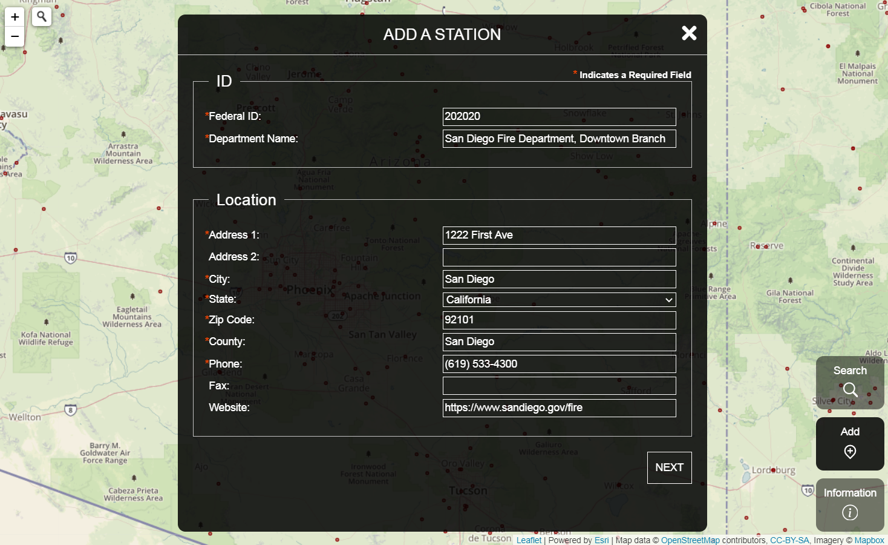
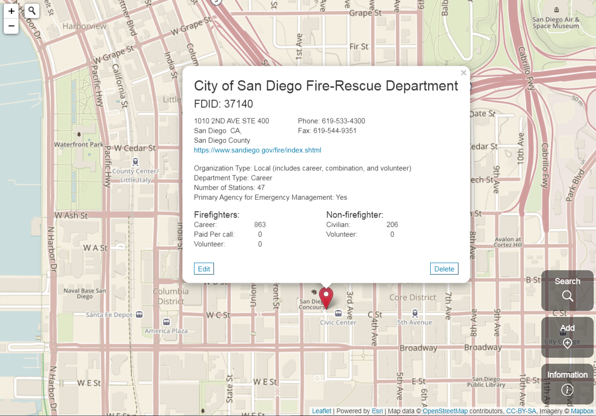

# FEMA Fire Departments Database

  

MERN Stack application in the form of a react-leaflet webmap.  This application displays all FEMA-registered fire departments on a map.  Full Create Read Update Delete functionality.

## Visualizing Federal Emergency Management Agency Data

FEMA's [fire department registry](https://apps.usfa.fema.gov/registry/) provides extensive data about fire departments throughout the US, including contact information, staffing data, and more.  This application provides a visually pleasing format to view departments on a map.  It offers search and filter capablities similar to those on the FEMA registry site.

This application is not connected to the official FEMA registry database. Changes made here will not be reflected there, and vice versa. This application is a proof-of-concept project for demonstration purposes. Adding or editing the dataset is open to the public, so please be considerate when doing so.

## Screenshots:

Introduction screen:

  

Filtering by state - Texas departments:

  

Filtering by county - Marin County departments:

  

Form to add a station:

  

Department data available in the popup:

  

## App Structure

The front end of this application is built on a foundation of react, redux, and leaflet.  It is compiled with a simple but custom webpack configuration.  The back end runs an express server, which serves the static files, and provides an API to enact CRUD functionality.  It utilizes [mongoose](https://mongoosejs.com/docs/) to connect to an Atlas MongoDB cluster.  It uses [Geocodio](https://www.geocod.io/) to geocode addresses for new additions.

## Develop

If you are interested in developing this application further, you can fork or clone it.  Running `npm run setup` in the root folder will install all dependencies for both the client and server applications, and `npm start` will build the front end, and run the backend server.  You can also `cd` into the `client` or `server` folders and with with each application individually.

### To do:

- Add better error handling for geocoding failures
- Add mini loading spinner in bottom left corner of map for map pan and zoom related API call wait periods
- Place all create, update, and delete functionality behind a login screen
